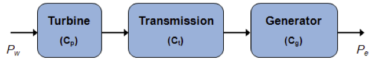
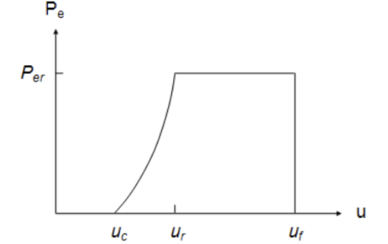
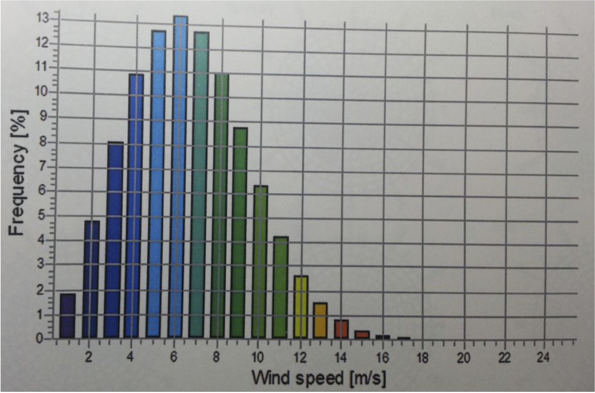

# Wind_Turbine_Model
<H4>Introduction</H4>
The overall objective here is to explore the feasibility 
of meeting the energy needs of our campus using 
wind turbines. For simplicity, we will model the operation 
of one turbine.  
 
As a first step, we must estimate the average or typical energy 
usage of our campus.  Shown below is the annual electricity 
usage for the years 2008-2013.
<TABLE ALIGN="CENTER" WIDTH="50%" BORDER="0"  CELLSPACING="0"  CELLPADDING="0">
  <TR  ALIGN="CENTER" VALIGN="TOP">
    <TD ALIGN="CENTER">
      <B>Year</B>
    </TD>
    <TD ALIGN="CENTER">
      <B>Electric Consumption (kWh)</B>
    </TD>
  </TR>
  <TR VALIGN="TOP">
    <TD ALIGN="CENTER">
      2008-2009
    </TD>
    <TD ALIGN="CENTER">
      13,571,150
    </TD>
  </TR>
  <TR VALIGN="TOP">
    <TD ALIGN="CENTER">
      2009-2010
    </TD>
    <TD ALIGN="CENTER">
      13,754,406
    </TD>
  </TR>
  <TR VALIGN="TOP">
    <TD ALIGN="CENTER">
      2010-2011
    </TD>
    <TD ALIGN="CENTER">
      12,657,243
    </TD>
  </TR>
  <TR VALIGN="TOP">
    <TD ALIGN="CENTER">
      2011-2012
    </TD>
    <TD ALIGN="CENTER">
      13,674,575
    </TD>
  </TR>
  <TR VALIGN="TOP">
    <TD ALIGN="CENTER">
      2012-2013
    </TD>
    <TD ALIGN="CENTER">
      11,703,801
    </TD>
  </TR>

</TABLE>

  
  </TR>
  <TR>
    <TD COLSPAN="2">
Note that the campus also consumes energy in other forms,
such as natural gas, particularly for heating. But for the 
purpose of this study we only consider electric consumption.
    </TD>
  </TR>

</TABLE>
<H4>Wind energy modeling: Some background</H4>

In a nutshell, here is how a wind turbine works:   
<UL>
  <LI>It converts the wind’s kinetic energy into rotational KE in the turbine.
  <LI>The rotational KE is converted into electrical energy.
  <LI>Conversion depends on wind speed and swept area of turbine.
  <LI>Efficiency losses occur at each stage.   
  
  $P_w=$ wind power; $P_e=$ electric power output;  
  $C_p$, $C_t$, $C_g$, are 
  constant efficiency coefficients 
</UL>

It is theoretically possible, from a 
simplified 1-D form of energy conservation laws, 
to estimate   
$~~~~~~~~~~~~\displaystyle P_w = \frac{1}{2}\rho A u^3 ~~~~~~~~~~~~
\displaystyle P_e = C_p C_t C_g P_w$   
where $\rho=$ air density, $A=$ swept area, $u=$ wind speed.  

<TABLE ALIGN="LEFT" WIDTH="80%" BORDER="0"  CELLSPACING="0"  CELLPADDING="0">
  <TR VALIGN="TOP">
    <TD WIDTH="50%">
However, in practice, it is very difficult to estimate reliable 
values for all the needed parameters. Therefore, a more common 
way to model the electric power output of a wind turbine is 
to use a "power curve," such as the one shown in the sketch. 
  
From the curve, the electric power is a function of 
$u$, and has the form    
$~~~~~~~~~~~~\displaystyle P_w = \frac{1}{2}\rho A u^3 ~~~~~~~~~~~~
\displaystyle P_e = C_p C_t C_g P_w$   
where $\rho=$ air density, $A=$ swept area, $u=$ wind speed.  

<TABLE ALIGN="LEFT" WIDTH="80%" BORDER="0"  CELLSPACING="0"  CELLPADDING="0">
  <TR VALIGN="TOP">
    <TD WIDTH="50%">
However, in practice, it is very difficult to estimate reliable 
values for all the needed parameters. Therefore, a more common 
way to model the electric power output of a wind turbine is 
to use a "power curve," such as the one shown in the sketch. 
  
From the curve, the electric power is a function of 
$u$, and has the form   
$~~~~~~~~P_e(u)=\left\{\begin{array}{ll} a + b u^\alpha, & \mbox{ if } u_c \le u \le u_r  \\
            P_{er}, & \mbox{ if } u_r < u \le u_f \\ 
             0, & \mbox{ if } u>u_f \end{array}\right.$
    </TD>
    <TD ALIGN="CENTER">
      Wind turbine power curve  
      
    </TD>
  </TR>
</TABLE>
where  
$~~~~u_c=$ cut-in wind speed, where electric power output rises above 0  
$~~~~u_r=$ rated wind speed  
$~~~~u_f=$ furling wind speed, at which turbine is shut off to prevent damage  
$~~~~\alpha$ is a fitting parameter whose value is typically close to 2    
$~~~~P_{er}$ is the rated power output under optimal wind conditions.   
    Numerical&nbsp;values of all these parameters depend on design, 
manufacture and installation properties of the wind turbine.

<H4>How to estimate total power output?</H4>

By integration, of course! But we need one more piece of 
information, i.e., the distribution of actual wind speeds at the 
turbine location. This typically comes from historical 
meteorological data, in the form of a probability density 
function.  For example, a Weibull distribution is frequently 
used to model wind speed data.
  
<TABLE ALIGN="LEFT" WIDTH="80%" BORDER="0"  CELLSPACING="0"  CELLPADDING="0">
  <TR VALIGN="TOP">
    <TD WIDTH="50%"> 
Weibull pdf (probability density function): 
$\displaystyle f(u)=\frac{\frac{k}{c}(\frac{u}{c})^{k-1}}{e^{(\frac{u}{c})^k}}$   
$k$ and $c$ are model parameters that depend on the 
median and variability in wind speeds.   
Estimated power output: $\displaystyle P_{tot}=\int_0^\infty P_e(u) f(u) du$ 
where $P_e(u)$ and $f(u)$ are both given by expressions above.  
    </TD>
    <TD ALIGN="CENTER">
      Wind speed distribution  
      
    </TD>
  </TR>
</TABLE>
